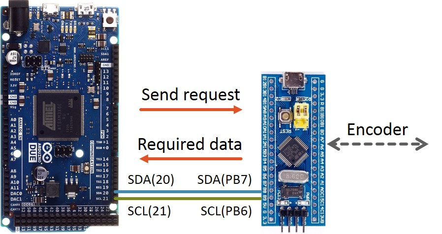
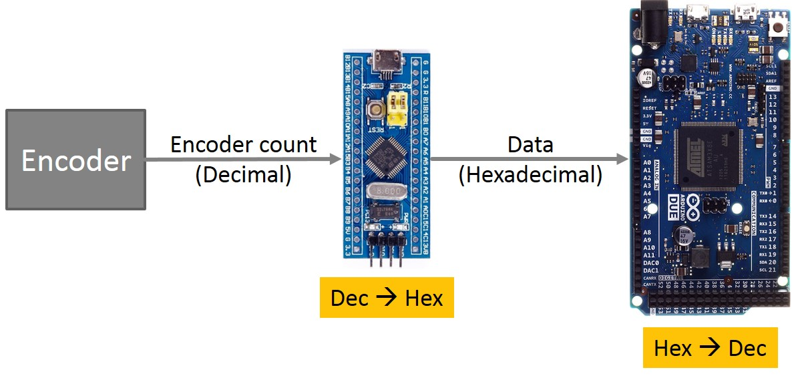
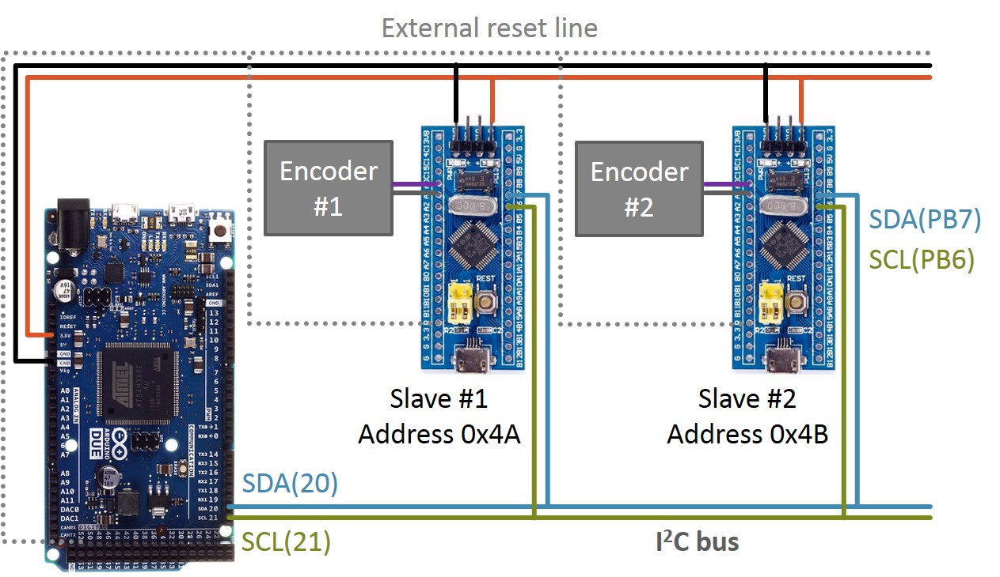
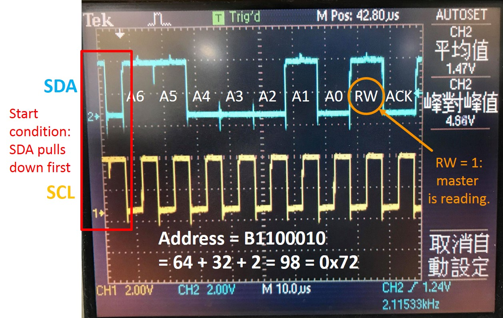
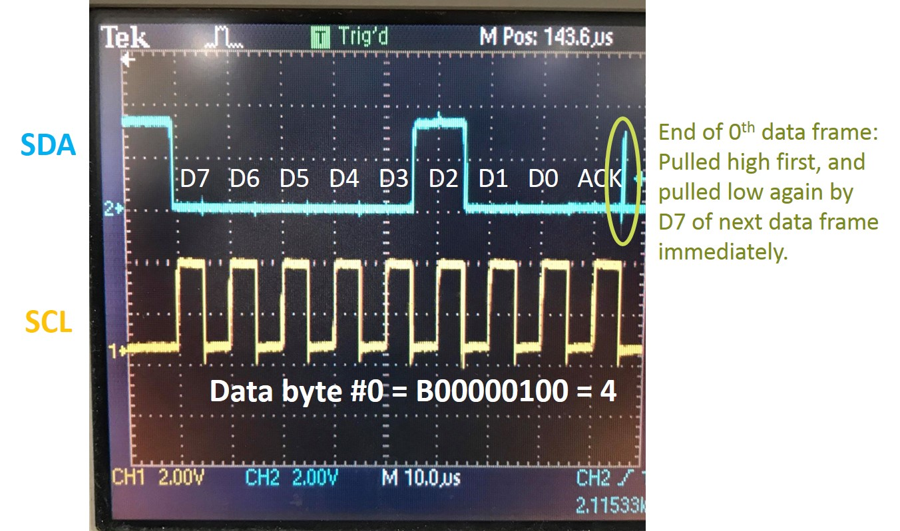
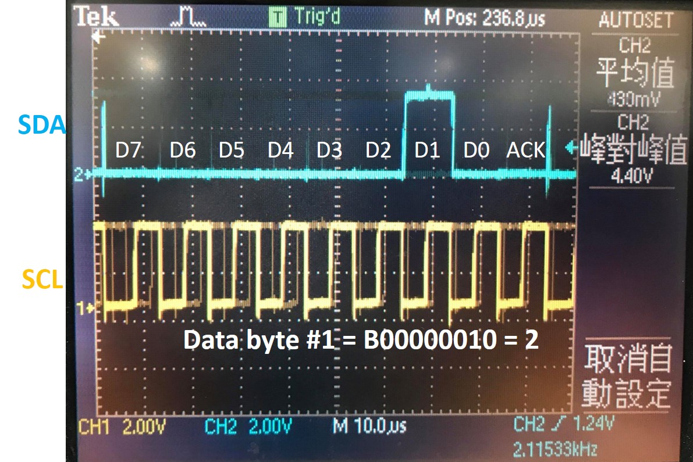
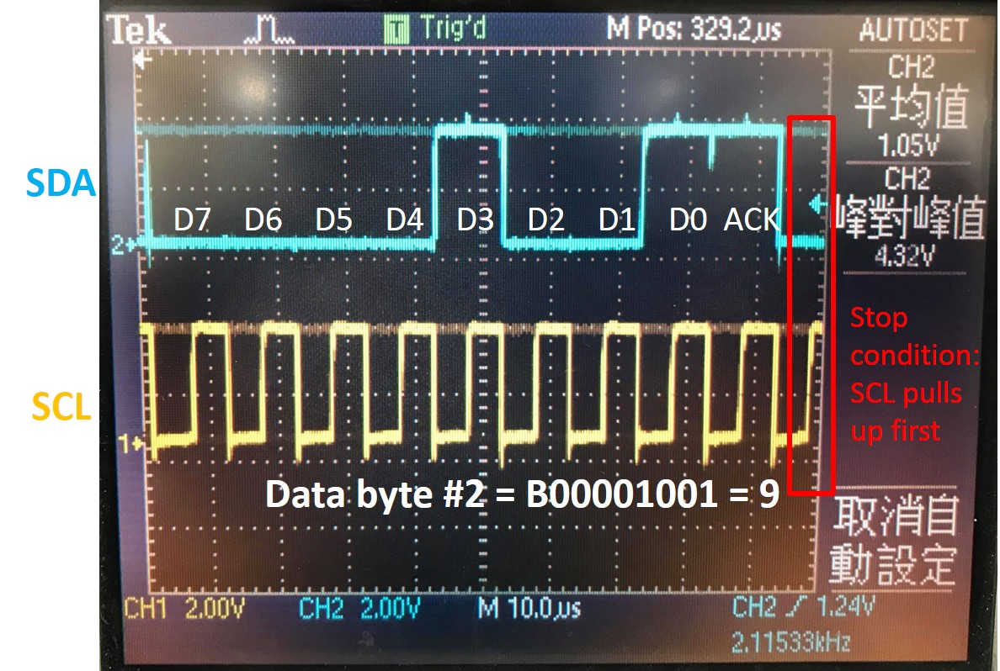

# STM32F1_I2C_MotorModule

Please refer to this repository for implementation details.
https://github.com/wildcat5566/Quadrature_Encoder_STM32F0

STM32F103C8T6 as slave transmitter, Arduino Due as master receiver.

## Project objective
Objective is to read from a quadrature encoder with an STM32F103 and to pass reading value to an Arduino Due via I2C.  
For quadrature encoder reading and logic please see this repo for details:  
https://github.com/wildcat5566/Quadrature_Encoder_STM32F0  
The STM32F103(s) as slave transmitter(s) and the Arduino Due as the master receiver.  
 

Since data is transmitted in 8-bit hexadecimal form, we follow the flow described in the diagram below. 
On slave side we convert decimals reading into hexadecimal, transmit it via I2C, and do the reversed conversion on master side. 
 

## Hardware setup
The master and slaves are connected on the I2C bus as shown in diagram below. 
As for the "external reset line", it's intended to reset all slaves every time we reset the master.  
This is implemented on master side, by pulling the voltage low on this external reset line and then releasing it. 
 
> void setup(){  
> ......  
> digitalWrite(22, LOW);  
> delay(10);  
> digitalWrite(22, HIGH);  
> }  
 

## I2C Signals
Here are some oscilloscope screenshots and explanations of I2C signals during data transmission:

